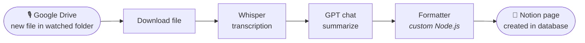

# Speech to Text to Notion

**Drop an audio file into a Google Drive folder → get a transcribed, AI-summarized page in Notion.**

A [Pipedream](https://pipedream.com) workflow that turns voice memos into structured notes: instant Google Drive trigger, OpenAI Whisper transcription, GPT summarization, a custom formatting step, and automatic Notion page creation.

> **Try it:** deploy a copy of this workflow into your own Pipedream workspace → [pipedream.com/new?h=tch_egfzp4](https://pipedream.com/new?h=tch_egfzp4)

## How it works

Record a voice memo, drop it in the watched Drive folder (mine is called *Voice to Text*), and within moments a Notion page appears containing a clean title, a summary, additional context, and the full transcript broken into readable paragraphs.

## Pipeline

| # | Step | Component | What it does |
|---|------|-----------|--------------|
| 1 | Trigger | `google_drive-new-files-instant` | Push-notification (webhook) trigger on a specific Drive folder — fires instantly on upload, no polling |
| 2 | `download_file` | `google_drive-download-file` | Downloads the audio file to workflow storage |
| 3 | `create_transcription` | `openai-create-transcription` | Speech-to-text via OpenAI Whisper |
| 4 | `chat` | `openai-chat` | Prompts GPT to produce a titled summary in delimited sections (`--Summary--`, `--Additional Info--`) |
| 5 | `Formatter` | **custom code** → [`steps/formatter.js`](steps/formatter.js) | Parses the AI output and formats the transcript (details below) |
| 6 | `create_page_from_database` | `notion-create-page-from-database` | Creates the finished page in a Notion database |

Steps 1–4 and 6 are Pipedream registry components — configuration over reinvention. The glue that makes the output readable is the custom step:

### The Formatter ([`steps/formatter.js`](steps/formatter.js))

- **Paragraphizes raw transcripts.** Whisper returns a wall of text; the formatter splits it into sentences by punctuation and regroups them three to a paragraph.
- **Handles punctuation-free speech.** If the transcript has no sentence-ending punctuation at all (it happens with fast dictation), it falls back to splitting on word boundaries at ~800 characters so no paragraph becomes unreadable.
- **Parses the AI summary into fields.** Splits the GPT response on its section delimiters into `title`, `summary`, and `additional_info`, with the whole response passed through untouched if any delimiter is missing — a malformed AI reply degrades gracefully instead of breaking the run.
- Returns a single structured object (`title` / `transcript` / `summary` / `additional_info`) that maps directly onto Notion page properties and body.

## Deploy your own

1. Open the share link: **[pipedream.com/new?h=tch_egfzp4](https://pipedream.com/new?h=tch_egfzp4)**
2. Connect your **Google Drive**, **OpenAI**, and **Notion** accounts when prompted.
3. Pick the Drive folder to watch and the Notion database to write to.
4. Record something and drop it in the folder.

## Credits

The voice-note-to-Notion pattern this workflow follows was popularized by [Thomas Frank's Notion automation tutorial](https://thomasjfrank.com/how-to-transcribe-audio-to-text-with-chatgpt-and-notion/); this deployment adapts and configures it as part of my personal automation toolkit, paired with [Database Buddy](https://github.com/IsaiahAnson/database-buddy) for document-based knowledge capture.

## License

Copyright (c) 2026 Isaiah Anson. All rights reserved. You may use the released software for
personal, non-commercial use; copying, modifying or redistributing it requires written
permission. See [LICENSE](LICENSE).

